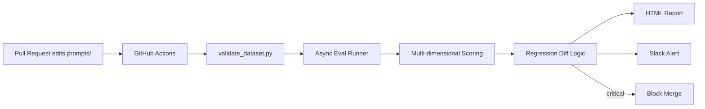

# Model Regression Detection System

A CI/CD pipeline for LLM prompt behavior — catches quality regressions in an
LLM-powered feature **before** they reach production, the same way unit
tests catch code regressions.

## Why this exists

LLM prompts drift silently. A one-line "improvement" to a system prompt can
quietly break behavior on cases that were never touched — and a naive
before/after accuracy check (e.g. "92% → 93%, ship it") can completely miss
individual regressions hiding inside a net-positive aggregate number. This
project treats prompts like code: every change to a prompt file runs a
100-case hand-labeled evaluation, diffs the result against the last known-good
run, and blocks the merge if it regresses past a configurable threshold —
automatically, on every pull request.

**This isn't a hypothetical.** During development, a prompt edit intended to
fix one narrow ambiguity case caused a real 9% regression across nine
unrelated cases — caught automatically by this pipeline's CI gate before it
could reach `main`. See `results/report.html` for the actual diff.

## Architecture



## Quick start

```bash
git clone https://github.com/Harshmishra87/model-regression-detector.git
cd model-regression-detector
python -m venv venv
venv\Scripts\activate          # Windows
pip install -r requirements.txt
cp .env.example .env           # fill in GEMINI_API_KEY and SLACK_WEBHOOK_URL
python -m src.main
```

Or via Docker:

```bash
docker build -t regression-detector .
docker run --env-file .env regression-detector
```

## How it works

1. **Golden dataset** (`data/golden_dataset.json`) — 100 hand-labeled customer
   support emails across 4 categories (billing, technical, account, general),
   spanning easy/medium/hard difficulty, including deliberately ambiguous and
   multi-issue cases.
2. **Runner** (`src/runner.py`) — runs the classifier against every case,
   rate-limit-aware with retry/backoff for free-tier API quotas.
3. **Scoring** (`src/scoring.py`) — two independent dimensions per case:
   exact-match category accuracy, and an LLM-as-judge quality score (1–5) on
   the generated summary.
4. **Regression diff** (`src/compare.py`) — matches cases by stable ID across
   two runs and reports exactly which cases flipped from passing to failing
   (not just an aggregate delta).
5. **Thresholds** (`src/thresholds.py`) — configurable warning/critical
   severity bands, plus a 7-run moving-average check that catches slow drift
   across many small changes that no single run would trigger alone.
6. **Reporting & alerting** (`src/report.py`, `src/alert.py`) — an HTML diff
   report with side-by-side old/new outputs, and a Slack alert on any
   non-passing run.
7. **CI gate** (`.github/workflows/eval.yml`) — runs on every PR that touches
   `prompts/**`, and a critical regression fails the check, which branch
   protection uses to physically block the merge button.

## Adding new golden dataset cases

Add an entry to `data/golden_dataset.json` with a unique `id`, then run:

```bash
python src/validate_dataset.py
```

This checks for schema issues, duplicate IDs, and category imbalance before
any case reaches an actual eval run.

## Adjusting thresholds

Set in `.env`:

```
WARNING_THRESHOLD=0.03   # 3% pass-rate drop triggers a warning
CRITICAL_THRESHOLD=0.08  # 8% pass-rate drop blocks the merge
```

## Design decisions

- **JSON files instead of a database.** At 100 cases, a database adds
  operational overhead (hosting, migrations, connection handling) with no
  real benefit. JSON files are git-diffable, require zero infrastructure, and
  keep the entire system runnable with nothing but a filesystem.
- **Two severity tiers, not one.** A single "pass/fail" threshold forces an
  uncomfortable binary on genuinely different situations. A small dip is
  worth a Slack heads-up without blocking anyone's afternoon; a large one
  should be a hard stop. Two tiers map to how teams actually want to react.
- **LLM-as-judge for summary quality, exact-match for category.** Category
  correctness has one right answer, so exact match is the honest metric.
  Summary quality is inherently fuzzy — semantically correct summaries can be
  worded many different ways — so a second LLM call, scoped to a narrow 1–5
  rating rubric, is more honest than any string-similarity heuristic.

## Known limitations

- Free-tier LLM API quotas (both per-minute and per-day) constrain how often
  the full 100-case pipeline can run — a real production system would need a
  paid tier for frequent CI runs.
- The "pass" bar (`category_score == 1 AND quality_score >= 3`) is a starting
  threshold, tuned by hand rather than derived from a labeled calibration set.
- Golden dataset covers one feature (email triage classification) — the
  scoring/diffing/alerting layers are feature-agnostic, but currently only
  wired to this one dataset and prompt.

## Tech stack

Python · Gemini API (`google-genai`) · Pydantic · Jinja2 · GitHub Actions ·
Docker · Slack Incoming Webhooks
